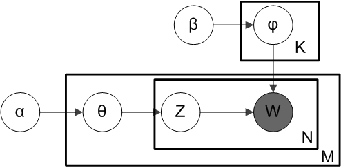

```{r setup, include=FALSE}
knitr::opts_chunk$set(echo = FALSE, message = FALSE, warning = FALSE)
library(quanteda)
library(tidyverse)
```

# Objective

- objectively chart the sustainability themes of food retailers
- identify relevant topics that we must not miss
- match our sustainability focus areas with those of retailers

# Method
Using *quanteda*, we perform text analysis of `r nrow(docvars)` sustainability reports of European food retailers over 2020 (published 2021) or the closest year we can get. Some of the reports are in other languages than English. These were machine-translated into English using Deepl.com. Then we perform some supervised and non-supervised text analyses.
Some of the sustainability reports were annual reports with a section on sustainability, so called "integrated" reports. 
OF all reports the document variables of the retailer publishing, the year of publication and the type (SR = sustainability report, AR = annual report, GC = Global Compact communication) were recorded.

```{r stats1, echo=FALSE, message = FALSE}

#load bulk data
load("mat_mr.Rdata")

library(readxl)
company_names <- read_excel("company_names.xlsx") 

#construct corpus
corp_mr <- quanteda::corpus(mat_mr)

#make corpus subset based on language
corp_en <- corpus_subset(corp_mr, language == "EN")
docvars <- docvars(corp_en)

# number of English reports
#nrow(docvars)
```
The documents were converted from pdf to text and stored in a corpus (library or collection of documents). The corpus was further preprocessed, by removing numbers, spaces, various frequently appearing words, such as the names of the retailers, lower cased, stopwords were removed, and finally stemmed. The tokenized corpus was converted to a document-feature matrix (dfm). The dfm is the basis for further analysis.

```{r stats2, eval = TRUE, echo = FALSE}
# retrieve text stats by company
load("raw_stats.Rda")
clean_stats <- raw_stats %>% 
  mutate(company = substr(document, 12,19)) %>%
  left_join(.,company_names) 
```
## Description of the reports
The following graph shows the number of sentences in the reports per retailer.

```{r plot, eval=TRUE, echo = FALSE, message = FALSE, warnings = FALSE}
library(ggthemes)
library(ggrepel)
#determine order og high to low sentence scores for ggplot
order <- clean_stats %>% 
  group_by(retailer) %>%
  summarize(zinnen = sum(sents), country= as.factor(country), retailer = as.factor(retailer)) %>% 
  unique() %>%
  group_by(country) %>%
  summarize(z = sum(zinnen)) %>%
  arrange(desc(z)) %>%
  pull(country)

p <- clean_stats %>% 
  group_by(retailer) %>%
  summarize(zinnen = sum(sents), country= as.factor(country), retailer = as.factor(retailer)) %>%
  unique() %>%
  ggplot(aes(reorder(country, -zinnen), zinnen, label = retailer, fill = retailer)) +
  geom_bar(stat = "identity") +
  geom_text(size = 3, position = position_stack(vjust = 0.5)) +
  ggtitle("Number of sentences in SR of food retail per country") +
  xlab("country") + ylab("Number of sentences") +
  theme_economist() 
suppressWarnings(print(p + theme(legend.position="none") +
  scale_x_discrete(limits=order)  #this puts the columns in the order of the highest to lowest
))

```
## Topic Modeling
We can perform an unsupervised topic modeling procedure on the corpus using Latent Dirichlet Allocation. This allows to automatically extract a number of topics accross documents.

\newpage

### Latent Dirichlet Allocation (LDA)
LDA assumes that every document in a corpus is a random mixture of latent topics. Every topic is considered as a mixture or distribution of words. LDA is an algorithm that tries to find the mixture of words that best defines a set number of topics, while at the same time estimating the mixture of topics that describes a document. LDA computes for every word the probability that it belongs to a certain topic (beta) and the estimated probability that a word in a document belongs to a certain topic (theta). Retrieving the words with the highest thetas allows to characterize the topic.


```{r, echo=FALSE, out.width="40%", fig.cap="LDA model"}

```
In the above figure of the LDA algorithm ("plate model") denote:

- alpha - the per-document topic distributions,
- beta  - the per-topic word distribution,
- theta - the topic distribution for document m,
- psi   - the word distribution for topic k,
- z     - the topic for the n-th word in document m, and
- w     - the specific word

### Applying LDA to the food retailer sustainability report corpus

Using the package *seededlda* an LDA model was estimated, using 9 topics. This number was chosen somewhat arbitrarily but appeared to give a reasonable resolution and discrimination between topics.

```{r lda, echo=FALSE, warning=FALSE, results = FALSE}
library(quanteda)
library(readtext)
library(quanteda.textstats)
library(seededlda)
library(topicmodels)
library(stringr)
library(tidyverse)

#split in paragraphs
corp_mr_par <- corp_en %>%
  corpus_segment(pattern = "•")
docvars(corp_mr_par) %>% group_by(company, year) %>% summarize()

#make a list of unique company designators
company_list <- unique(docvars(corp_en)) %>% select(company)
write_excel_csv(company_list, "companylist.txt")

#read company names
library(readxl)
company_names <- read_excel("company_names.xlsx") 
cl <- company_names$retailer %>% tokens() %>% tokens_split() %>% unlist()
words <- c("sek", "eur", "ica", "coop", "colruyt", "axfood", "ahold", "delhaize",
           "million", "appendix", "see", "axfood's", "gruppen's","co-op", "asda",
           "aldi", "per", "year", "also", "can", "use", "chf", "finland",
           "switzerland", "delhaize's", "years", "euro", "sweden", "kesko",
           "spain", "steghaus", "mbb", "italian", "thanks", "new", "u.s.",
           "transgourmet", "gmbh", "g.m.b.h.", "esselunga", "milan",
           "euro", "naturama", "della", "banco", "alimentar", "co-operative",
           "zurich", "basel", "bern", "franc", "billion", "italia",
           "april", "januari", "u.", "adriatico", "belgium", 
           "france", "swiss", "belgian", "virya","norgesgruppen",
           "baltic", "kesko")
cl <- append(cl, words)


#tokenize
toks_nostop <- corp_mr_par %>% 
  tokens(remove_punct = TRUE, remove_symbols = TRUE, 
         remove_numbers = TRUE, remove_url = TRUE) %>% 
  tokens_select(min_nchar = 3) %>%
  tokens_remove(stopwords("en")) %>%
  tokens_remove(pattern = cl) %>%
  tokens_remove(c("*-time", "*-timeUpdated", "GMT", "BST", "*.com", "ltd", "group", 
                  "holdings", "inc", "business"))  


# create document feature matrices
# base dfm 
dfm <- dfm(toks_nostop) %>%dfm_remove(pattern = cl)
dfm_stem <- dfm_wordstem(dfm)
```

```{r lda loader, echo=FALSE, warnings = FALSE, results = FALSE}
# read LDA
load("lda.Rdata") #load previously computed lda-model to avoid confusion of topics
summary(lda)
df_lda <- as.data.frame(lda$theta) %>% 
  tibble::rownames_to_column(., "document")

```


```{r lda_output, fig.cap = "Table 1. SR sentences per retailer", echo = FALSE, warning=FALSE }
# compute document variables
library(kableExtra)
nt <- ntoken(dfm_stem) %>% as.data.frame() %>% rownames_to_column() 
colnames(nt) <- c("document", "number")
nt <- nt %>% mutate(company = substr(document, 12,19)) %>%
  left_join(.,company_names) 
nt %>% group_by(country, retailer) %>% summarize(no_of_tokens = sum(number)) %>% 
  arrange(desc(no_of_tokens)) %>% kable(., booktabs = TRUE) %>%
  kable_styling(font_size = 11, bootstrap_options = c("striped", "hover", "condensed"))
```

The following table  shows the ten words with the highest theta's per topic. These characterize the topic.

```{r terms, fig.cap = "Table 2. LDA terms per topic", echo=FALSE }
library(readr)
terms <- read_csv("terms.txt")
kable(head(terms, 10), booktabs = TRUE) %>%
  kable_styling(font_size = 10)

```

From the topic words we can derive a more descriptive name for the topic. Then we can plot the topics against the retailers. It is to note that the theta's of all the topics together sum to 1. So whether the retailer in question publishes a large report or a small one, the theta's give a relative probability of the presence of the topics in the document, irrespective of the document size. So there is no weighting for document size or the importance that subjects take relative to other documents. 

```{r lda_plot, echo=FALSE}
#write results to data frame
theta <- as.data.frame(lda$theta)
theta <- tibble::rownames_to_column(theta, "document")
theta <- theta %>% mutate(company = substr(document, 12,19),
       year = substr(document, 1,4),
       type = substr(document, 6,7)) %>%
  left_join(., company_names) %>%
rename(., "social_supply_chain" = topic7,
       "customer_store" = topic8,
       "waste_emission" = topic1,
       "employee_relations" = topic2,
       "finance_accounting" = topic4,
       "charity" = topic6,
       "governance" = topic9,
       "risk" = topic5,
       "product_brand_certification" = topic3)
#theta[which(is.na(theta$retailer)==TRUE),]

theta %>% select(-c("year", "type")) %>%
  pivot_longer(., cols = 2:10, names_to = "topic", values_to = "theta") %>%
  group_by(country, topic) %>%
  summarize(value = mean(theta)) %>%
  ggplot(aes(country, value)) +
  geom_col() +
  facet_wrap(vars(topic)) +
  coord_flip()
#https://tm4ss.github.io/docs/Tutorial_6_Topic_Models.html
```

Likewise, we can check if there are marked differences in topics between types of reports, notably integrated or annual reports and sustainability reports.

```{r report_type, echo=FALSE}
theta %>% select(-c("year")) %>%
  filter(type %in% c("AR", "SR")) %>%
  pivot_longer(., cols = 2:10, names_to = "topic", values_to = "theta") %>%
  group_by(type, topic) %>%
  summarize(value = mean(theta)) %>%
  ggplot(aes(type, value)) +
  geom_col() +
  facet_wrap(vars(topic)) +
  coord_flip()
```

If we had a time series of sustainability reports, it would be possible to visualize temporal changes in topics.
